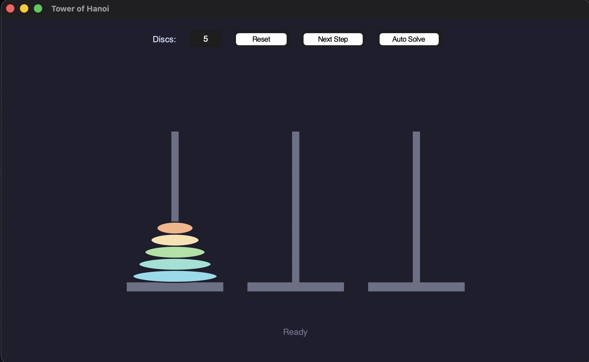
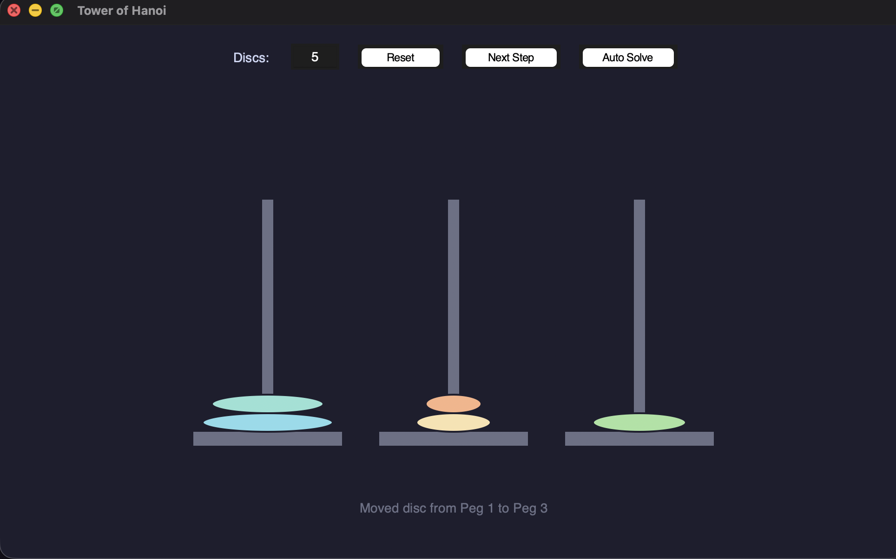
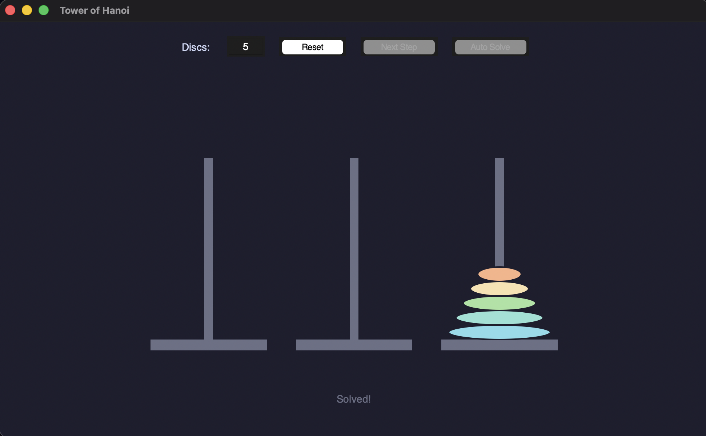

# Tower of Hanoi - Python GUI

A sleek, minimalist dark-mode implementation of the classic Tower of Hanoi puzzle built entirely in Python using the built-in `tkinter` library.

## Features
- **Customizable Difficulty:** Choose anywhere from 1 to 15 discs.
- **Auto-Solve:** Watch the algorithm solve the puzzle automatically with animated steps.
- **Manual Stepping:** Click through the solution one step at a time at your own pace.
- **Minimalist Dark Theme:** A visually pleasing, modern user interface.
- **Zero Dependencies:** Uses standard Python libraries, so no `pip install` is required!

## Prerequisites
- Python 3.x installed on your system.

## How to Run
1. Clone this repository or download the `hanoi.py` file.
2. Open your terminal or command prompt.
3. Navigate to the directory containing the file.
4. Run the following command:
   ```bash
   python hanoi.py
   ```
   *(Note: Depending on your system, you may need to use `python3 hanoi.py`)*

## How to Play / Use
- **Discs:** Enter the number of discs in the top input box and click **Reset** to apply.
- **Next Step:** Manually advance the puzzle by one valid move.
- **Auto Solve:** Click to start the automatic animation. Click again to pause.

## Screenshots




## License
Feel free to use, modify, and distribute this code for practice or personal projects!
